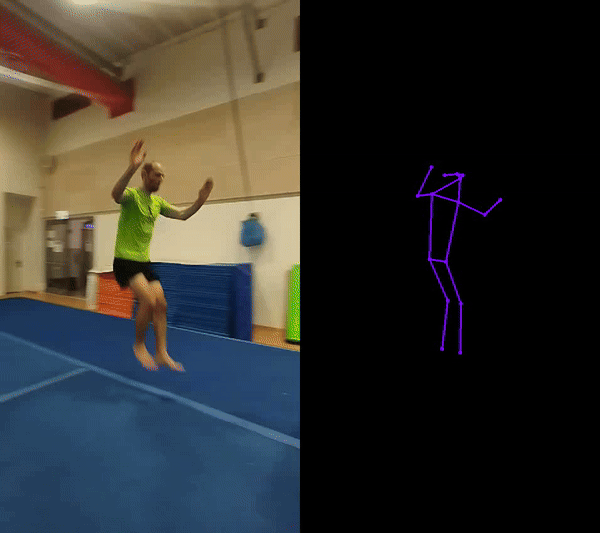

# Tricking Video Highlight Extractor

This project uses computer vision techniques to extract highlights from videos, focusing on human pose estimation.
Also, for technique improvement, it shows the original video and skeleton side-by-side

# Demo



## License

The YOLO models used in this project (YOLOv8) are licensed under the GNU General Public License v3.0 (GPL-3.0). For more details, please see the [Ultralytics YOLO repository](https://github.com/ultralytics/ultralytics).

## Installation


## Usage

Run the script with the following command:
```bash
python highlights/app.py --input_path <input path> --output_path <output path>  --fast --save_debug
```
you can choose fast (less accurate), medium and slow (very accurate) models. debug mode is optional to get parquet files with the keypoints and charts of movement.
highlight videos and skeleton highlight movies will be saved in the output path.
